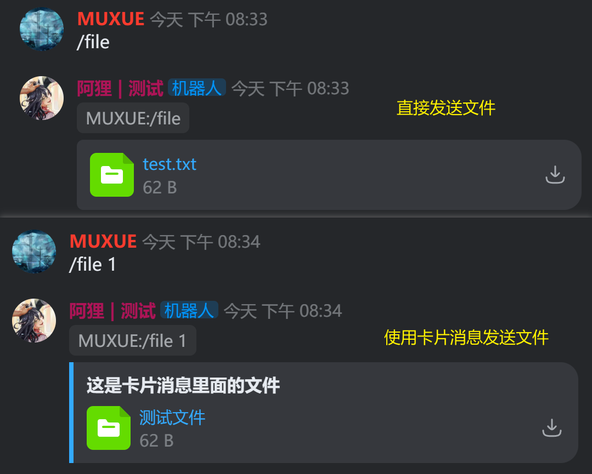

## 1.图片

### 1.1 上传图片

要想发送图片，首先需要机器人将图片上传到 KOOK 中，对应函数为 `create_asset`，其返回值为图片的链接

~~~python
await bot.client.create_asset("文件路径")
~~~

### 1.2 函数使用

这个函数能接收多种类型的参数，示例如下

~~~python
async def img_upload(file_path:str):
    """图片上传函数"""
    # 方法1 文件路径
    img_url = await bot.client.create_asset(file_path)
    print("str path ",img_url) # 图片url

    # 方法2 文件io对象
    img = None
    with open(file_path,'rb') as f:
        img = io.BytesIO(f.read())
        # 下面的方式也可以，但是在传入create_asset函数时，编译器可能会报参数不匹配的警告
        # img = io.BytesIO(f.read()).getvalue() 
    
    img_url = await bot.client.create_asset(img) 
    print("open ",img_url)

    # 方法3 和PIL库对接
    img = Image.open(file_path)
    img_byte_arr = io.BytesIO()
    img.save(img_byte_arr, format='PNG') # 保存到内存中
    # img.save('./test.png') # 保存到磁盘中（仅作测试）
    img_byte = io.BytesIO(img_byte_arr.getvalue()) # 获取到bytes对象，再套一层io避免报警告
    img_url = await bot.client.create_asset(img_byte) # 上传
    print("PIL ",img_url)

    return img_url
~~~

在 `config` 路径下，我放入了本站的 `logo` 图片，使用 `create_asset` 函数将其上传到 KOOK


### 1.3 命令示例

将如上操作封装到命令中

~~~python
@bot.command(name='test')
async def test_cmd(msg:Message):
    try:
        print('get /test cmd')
        # 执行函数
        img_url = await img_upload('./config/logo.png')
    except:
        print("test cmd",traceback.format_exc()) # 打印错误信息
~~~

执行命令，控制台输出如下

~~~
get /test cmd
str path  https://img.kookapp.cn/attachments/2023-05/29/k2jUQW81GC05k05k.png
open  https://img.kookapp.cn/attachments/2023-05/29/k2jUQW81GC05k05k.png
PIL  https://img.kookapp.cn/attachments/2023-05/29/1Ic0of0v2205k05k.png
~~~

注意，如果你在上传以后，获取到了如下图片链接（空图片），则检查一下你的代码是否写对，图片是否正常上传

```
https://img.kaiheila.cn/attachments/2021-03/06/60438a85d38ae.jpg
```

### 1.4 发送图片代码

发送图片有两种方式，一种是直接发送，另一种是嵌入卡片消息发送；

在如下命令中，设置了一个 `type` 参数，作为图片上传方式的选择。

~~~python
@bot.command(name='img')
async def img_cmd(msg:Message,stype:int=0):
    """发送图片消息"""
    try:
        print('get /img cmd',stype)
        if stype == 0:
            # 直接上传图片
            await msg.reply(IMG_URL,type=MessageTypes.IMG) # 必须要指明 msg 的类型为 IMG 图片
            print("reply img only")
        else:
            # 卡片消息中的图片
            cm = CardMessage(Card(
                Module.Header("这是卡片消息里面的图片"),
                Module.Container(Element.Image(src=IMG_URL))
            ))
            # 使用了 Container 容器来存放 Image 元素，传入图片的 url 就可以了
            #  - 这里可以使用第三方图床的 url，但必须要保证该 url 能在国内被正常访问
            #  - 否则 kook 访问不到图片，会报卡片消息 json 格式不正确的错误
            await msg.reply(cm)
            print("reply img in cardmsg")
    except:
        print("img cmd",traceback.format_exc()) # 打印错误信息
~~~

### 1.5 直接发送图片效果


请注意，直接发送图片仅仅支持发送机器人自己`create_asset`获取的图片链接，其他**非机器人自己上传的kook图片链接**在发送的时候会产生报错；

除了kook的图片链接，你还可以在发送图片的时候，插入一个**国内可正常访问**的图床图片链接，此时该图片会被kook服务器下载后发送到客户端。

### 1.6 卡片消息发送图片

如下是使用卡片消息发送图片的效果


## 2.文件

上传文件的函数和上传图片是一样的

~~~python
await bot.client.create_asset("文件路径")
~~~

### 2.1 代码示例

在示例代码仓库的`config`文件夹中，我创建了一个`test.txt`文件，用于测试上传文件并发送到kook。

~~~python
@bot.command(name="file")
async def file_cmd(msg:Message,stype:int=0):
    """上传和发送文件"""
    try:
        print('get /file cmd',stype)
        file_url = await bot.client.create_asset('./config/test.txt') # 上传测试文件
        if stype == 0:
            # 直接发送文件
            await msg.reply(file_url,type=MessageTypes.FILE)
            print("reply file only")
        else:
            # 卡片消息中的文件
            cm = CardMessage(Card(
                Module.Header("这是卡片消息里面的文件"),
                Module.File(type="file",src=file_url,title='测试文件')
            ))
            await msg.reply(cm)
            print("reply file in cardmsg")
    except:
        print("file cmd",traceback.format_exc()) # 打印错误信息
~~~

注意，在使用卡片消息发送文件的时候，`Module.File`中应该指定第一个参数type为`file`。这里还可以转入`vedio`和`audio`这两个文件类型，分别指代视频文件和音频文件。

### 2.2 效果实例

下图展示了使用卡片消息和直接发送文件的不同效果




## 3.示例代码

本页面测试代码可见 [code/04.img_file.py](https://github.com/musnows/khl.py.docs/blob/main/code/04.img_file.py)